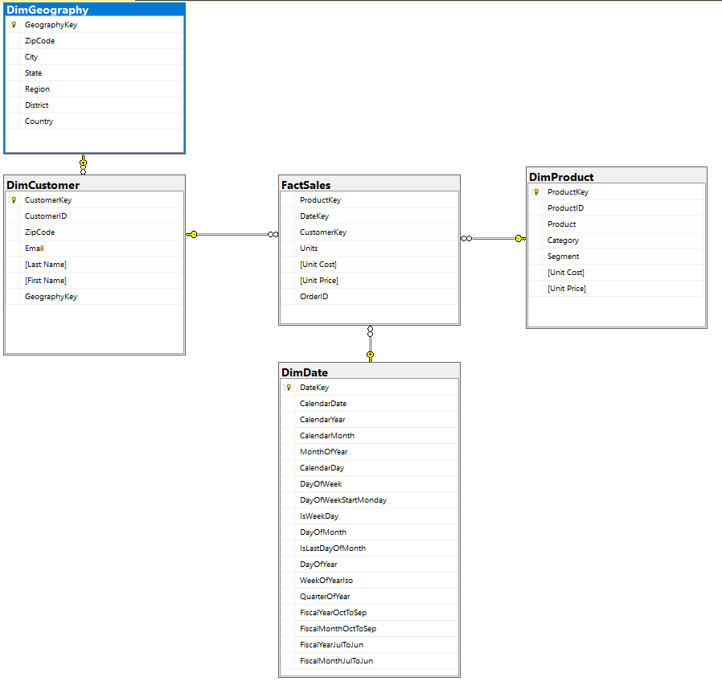

# ETL (Extract, Transform, Load) using PySpark

This project demonstrates the ETL process using PySpark for data modeling. It involves extracting data, transforming it into dimension tables, creating a date dimension table, and finally, joining these dimension tables with fact data.

## Table of Contents

- [Introduction](#introduction)
- [Data Loading](#data-loading)
- [Creating Dimension Tables](#creating-dimension-tables)
- [Creating a Date Dimension Table](#creating-a-date-dimension-table)
- [Joining Dimension Tables with Fact Data](#joining-dimension-tables-with-fact-data)

## Introduction

In this project, we perform ETL operations to model data for analytical purposes. The process involves several steps, including data extraction, transformation, and loading.

## Data Loading

In this section, we describe how to load the source data into PySpark for further processing. It includes information about the data source, format, and any preprocessing steps required.

## Creating Dimension Tables

Dimension tables are an essential part of data modeling. They store detailed information about specific entities and act as references for the fact table. In this section, we explain how dimension tables like DimProduct, DimGeography, DimCustomer, and others are created.

## Creating a Date Dimension Table

Date-related information is crucial for time-based analysis. We create a Date dimension table that stores various date attributes and fiscal year information. This section outlines how the Date dimension table is generated.

## Joining Dimension Tables with Fact Data

The FactSales table stores sales data, including references to dimension tables (ProductKey, DateKey, and CustomerKey) and various measures. In this section, we demonstrate how dimension tables are joined with the FactSales table to create a comprehensive data model.

# DataModeling

## Dimension Tables

### DimProduct

DimProduct stores information related to products. It includes details such as product names, categories, and descriptions.

### DimGeography

DimGeography stores geographic information. It contains data about cities, states, and countries.

### DimCustomer

DimCustomer stores customer information, including names, addresses, and contact details. It also includes a reference to the GeographyKey for linking to geographic data.

### DimDate

DimDate is a date dimension table. It stores date-related information, including various date attributes and fiscal year details.

## Fact Table

### FactSales

FactSales is the fact table that stores sales data. It includes references to the dimension tables (ProductKey, DateKey, and CustomerKey) and measures such as Units, Unit Cost, and Unit Price.

